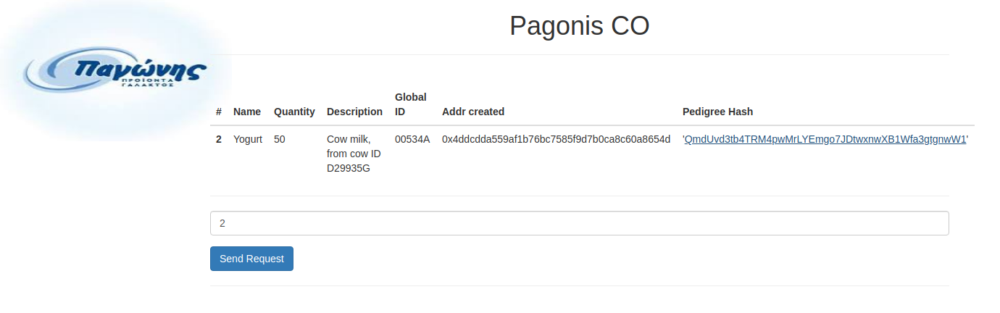

# food_supply_case_scenario
Blockchain Smart contracts to enable food supply in a real case scenario for PAGONIS DAIRY

http://www.pagonis-dairy.gr/en/

# Steps

1. Download all the code
2. Unzip node_modules
3. Open 2 terminals in the root folder (assuming that you have all the pre-requisites installed, otherwise check the smart contracts repo of my github)

3.1 In the first execute 
$ ganache-cli

3.2 In the second execute
$ truffle migrate --reset
$ npm run dev 

This will run the graphical web and enables query of the contents. There is a link to IPFS for each product sheet (actually testing, so the file is repeated)

